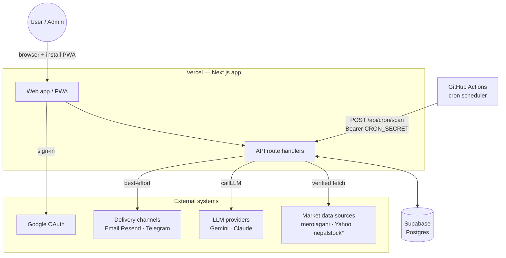
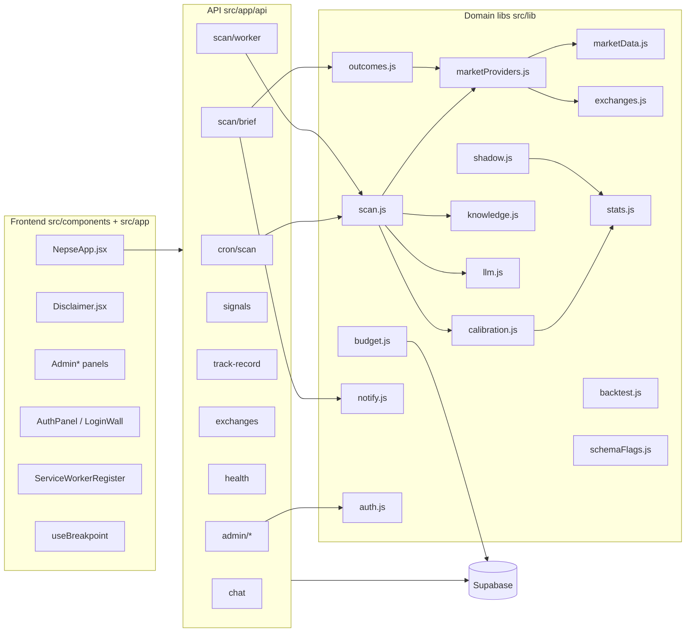
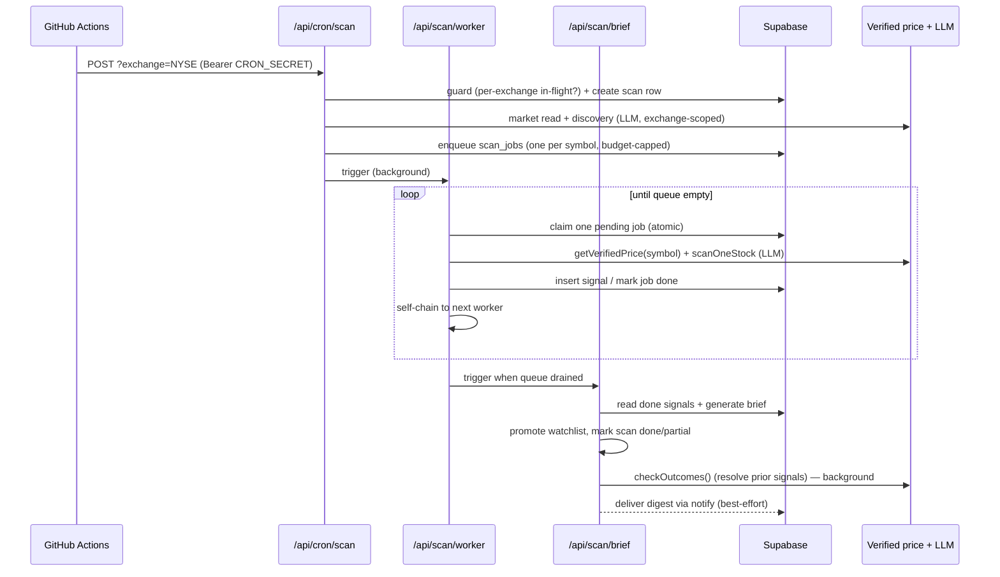
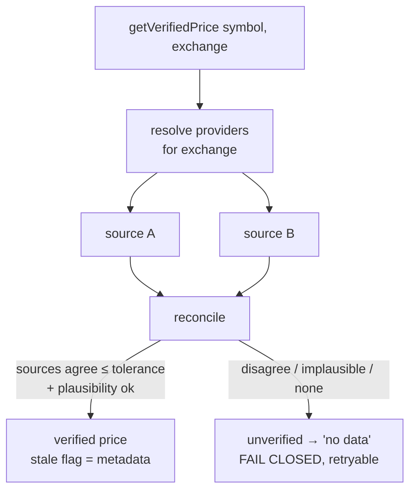
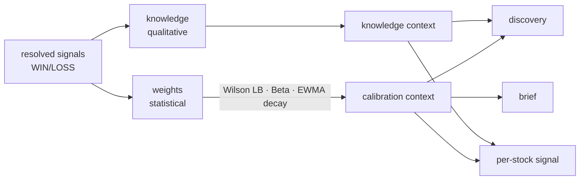
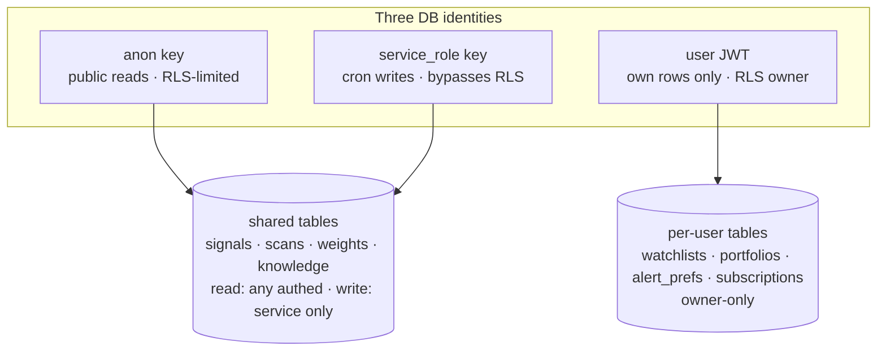
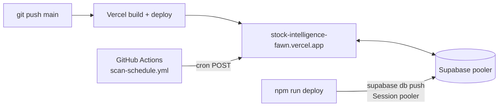

# Architecture — Stock Intelligence (NEPSE / NYSE)

High-level system documentation. For setup and env placement see
[`DEPLOYMENT.md`](./DEPLOYMENT.md); for the multi-exchange design see
[`NYSE-MULTI-EXCHANGE.md`](./NYSE-MULTI-EXCHANGE.md); for standing rules and the
product roadmap see the root [`CLAUDE.md`](../CLAUDE.md).

---

## 1. What this system is

An autonomous swing-trading **signal** agent for equity markets (NEPSE today, NYSE
enabled, exchange-pluggable). It **generates BUY / SELL / HOLD / AVOID signals**,
publishes a daily brief, tracks WIN/LOSS **outcomes**, and **learns** from them. It
is an *analyst copilot* — it produces research and a transparent track record; the
**user owns the trade decision**. It does **not** place trades.

- **Stack:** Next.js 14 (App Router, plain JS/ESM) · Supabase (Postgres) ·
  pluggable LLM (`gemini` default, `claude`) · Vercel Hobby · GitHub Actions (cron).
- **Framing:** every user-facing surface is "educational, not financial advice."

---

## 2. Design principles (load-bearing invariants)

These are enforced conventions, not aspirations. Full text in `CLAUDE.md`.

1. **Prices are ground truth, never LLM-sourced.** Every price flows through a
   verified layer that cross-checks sources and **fails closed** — an unverified
   quote is treated as "no data," not guessed. The LLM only *reasons over* verified
   numbers. (§6)
2. **Every LLM call degrades, never crashes.** When the daily budget is spent,
   `callLLM` returns `''`; each call site falls back to a deterministic result.
3. **Never persist a hollow signal.** No live price → throw (retryable job), never
   save an empty card.
4. **Respect the 60 s function budget.** Work is a self-chaining worker pipeline,
   never a blocking fan-out.
5. **Market data is GLOBAL, computed once per cycle and shared.** Cost scales with
   *distinct symbols*, not user count. (§9, §11)
6. **Side-channels are best-effort** (knowledge, events, alerts, calibration) — a
   failure there can never break a scan or an outcome resolution.
7. **Single-tenant today, by deliberate decision** (anon key, RLS off). Multi-tenant
   (Auth + per-user rows + RLS-on) is a planned additive layer. (§11)

---

## 3. System context

`*nepalstock` is build-ready but config-gated on an API token; `sharesansar` is a
stub. Vercel Hobby cannot run sub-daily crons, so **GitHub Actions is the
scheduler** — it just POSTs to the scan endpoint; all real work runs on Vercel.

---

## 4. Component map

---

## 5. The scan pipeline (core runtime)

One scan = one market cycle for one exchange. It is a **self-chaining worker
pipeline** that fits inside Vercel's 60 s-per-function budget: each stage does a
slice of work, persists state, and hands off to the next via a background trigger.

Key properties:
- **Idempotency guard** is *per-exchange* — a NEPSE scan never blocks a NYSE one.
- **Budget cap up front:** the queue is trimmed to what the day's LLM budget can
  afford; overflow is logged, not silently dropped.
- **Two modes:** `full` (market + discovery + scan) and `light` (watchlist only,
  reuses last market read — cheap intraday cadence).
- **Degradation:** if budget is spent mid-scan, the worker emits a deterministic
  signal from the last verified price rather than vanishing.

---

## 6. Verified-price layer (ground truth)

The money-critical boundary. Implemented in `marketData.js` (the engine) +
`marketProviders.js` (the provider registry + exchange routing).

- **Correctness is the gate, freshness is not.** A late-but-true quote (minutes/hours
  old) is accepted and flagged `stale`; only wrong/disagreeing/implausible data is
  rejected.
- **Config-gated providers:** each source declares `requiresEnv`; sources without
  their env are unavailable and cannot be selected. `merolagani` is LIVE (NEPSE
  default), `yahoo` powers NYSE (gated on `ENABLE_NYSE`), `nepalstock` is
  build-ready (gated on a token), `sharesansar` is a stub, `sample` is the offline
  placeholder (loudly flagged by the disclaimer).
- **Admin-selectable** via `/api/admin/sources`; the selector is server-enforced.

---

## 7. The learning loop

Two feed-forward tracks, both injected into discovery, per-stock signals, and the
brief. Both accrue **best-effort** (a failure never breaks a scan).

- **`weights` (statistical, `calibration.js` + `stats.js`):** a contextual bandit.
  Pure primitives — Wilson lower bound, Beta posterior, Thompson sampling,
  risk-adjusted reward, EWMA time-decay. The LLM reads a *confidence-adjusted* rate
  ("conservative X%"); leaderboards rank by Wilson LB so a thin "100% of 2" can't
  top a proven "75% of 30." Time-decay (`dwins`/`dlosses`) surfaces a
  recent-weighted rate for non-stationarity.
- **`knowledge` (qualitative, `knowledge.js`):** accrued textual lessons.
- **`backtest.js`:** the no-look-ahead replay/validation harness (win rate, avg
  return, Sharpe, max drawdown) — nothing ships as "edge" without passing here.
- **`shadow.js` (Shadow-B):** scores a would-be "signal service" track record
  **internally only** — never surfaced as actionable, per the B guardrail.

---

## 8. Multi-exchange architecture

Exchanges are a **pluggable dimension**, added without forking the shared engine.

- **`exchanges.js`** — the `EXCHANGES` registry (currency, hours, timezone,
  discovery seed, regulator-specific disclaimer, `sourceIds`, `reconcileOpts`) and
  `scopeKey(exchange, key)` for namespacing the learning loop. **NEPSE keys stay
  unprefixed** so the legacy path is byte-for-byte unchanged.
- **Routing:** `getVerifiedPrice(symbol, { exchange })` resolves that exchange's
  configured sources through the same availability gate, then feeds the shared
  verified-price core.
- **Data model:** `scans` and `signals` carry an `exchange` column (default
  `'NEPSE'`); `weights`/`knowledge` are scoped by *key*, not a column.
- **`schemaFlags.js`** — a cached probe (`exchangeColumnReady()`) that gates every
  exchange-*column* touch, so NEPSE runs identically whether or not the migration is
  applied. Market data stays **global per exchange** (§2.5): one scan per exchange
  serves every user of that market.

---

## 9. Data model

Canonical tables (`scans` = runs, `scan_jobs` = per-symbol queue — never
`scan_runs`). All shared/global today; writes are upserts with explicit
`onConflict`.

| Table | Role |
|---|---|
| `scans` | One row per scan run (status, phase, market, brief, `exchange`) |
| `scan_jobs` | Per-symbol work queue for a scan (claim/retry state) |
| `signals` | Every generated signal (price, entry/SL/target, why, outcome, `exchange`) |
| `outcomes` | Resolved WIN/LOSS results feeding the learning loop |
| `weights` | Statistical calibration (wins/losses + EWMA `dwins`/`dlosses`) |
| `knowledge` | Qualitative accrued lessons |
| `events` | Activity/audit stream surfaced in the UI |
| `alerts` | Alert records |
| `kv_store` | Singleton app state — watchlist, settings, portfolio, brief, usage |

> **Multi-tenant note:** per-user state (watchlist/settings/portfolio) currently
> lives as **global singletons** in `kv_store`. Splitting these into per-user tables
> is the core of Phase 2 (§11).

Migrations live in `supabase/migrations/` and are applied via `npm run deploy`
(Supabase Session pooler — the direct host is IPv6-only). Never edit the prod DB
directly.

---

## 10. Cross-cutting concerns

- **LLM abstraction (`llm.js`):** all model calls go through `callLLM`; provider
  SDKs (`anthropic.js`) are never imported into feature code. Output is parsed with
  `parseJson()` (returns `null` on junk). Provider is pluggable (`gemini`/`claude`).
- **Budget (`budget.js`):** a single **global** daily call ceiling. When spent,
  `callLLM` returns `''` and every call site degrades deterministically.
- **Delivery + observability (`notify.js`):** config-gated channels — email (Resend)
  and Telegram, each ACTIVE only when its env is set. The brief route delivers the
  digest and alerts on partial/failed scans, best-effort in the background. Admin
  sees channel status via `/api/admin/channels`.
- **Error handling (`respond.js`, `humanizeError.js`, `background.js`):** route
  guards, human-readable error mapping, and `waitUntil`-based background hand-off.
- **`/api/health`** — runtime readiness (env, DB tables, LLM, budget).

---

## 11. Auth & tenancy

**Today (single-tenant, deliberate):** one Supabase **anon** key for all reads and
writes; **RLS off**; shared global state. An **admin gate** (`auth.js`
`requireAdmin`) server-enforces `ADMIN_EMAILS` on `/api/admin/*`. Google Sign-In is
built (`authClient.js` / `useAuth.js` / `AuthPanel`) — identity-only, never triggers
a scan. An optional **hard login wall** (`LoginWall`, `NEXT_PUBLIC_REQUIRE_LOGIN`)
is off by default so the public track record stays viewable.

**Roles:** **admin** (system config — data sources, scan control, budget/schedule,
the internal shadow-B scoreboard) vs **user** (view signals/brief + own
watchlist/alerts). System-config is admin-only and **server-enforced**.

**Phase 2 target (multi-tenant, additive):**

Strict rollout order (getting it wrong = data leak or silent scan lockout): split
the Supabase client into anon/service/user roles → move shared-table **writes** to
the service role → add per-user tables (`user_id` there only) → turn **RLS on** →
rewrite per-user routes onto the user-scoped client. `user_id` is added **only** to
new per-user tables, never to `signals`/`scans`/`weights`/`knowledge`. A user's view
is a **filter over the shared signals**, not a re-fetch.

---

## 12. Frontend & PWA

- **`NepseApp.jsx`** — the single-page app shell: header, exchange switch, tabbed
  content (Today / Positions / Signals / Track Record / Watchlist / Settings), the
  Ask sidebar, activity log, and overlays. Data is a **view over shared signals**
  (`/api/signals?exchange=…`), polled via `/api/scan/status`.
- **Responsive layer** — mobile-first, additive: `useBreakpoint` (SSR-safe) +
  `breakpoints.js` (pure) + a CSS layer in `globals.css` (fluid `clamp()` type,
  container classes, safe-area insets, modal→bottom-sheet, responsive grids).
  Desktop is unchanged.
- **PWA** — `manifest.js` (Next file convention), branded icons, and an
  **offline-safe service worker** (`public/sw.js`) that **never caches `/api/*`** so
  live prices are never served stale (honors §2.1). Registered by
  `ServiceWorkerRegister`.
- **`Disclaimer.jsx`** — persistent on every surface; regulator copy follows the
  active exchange and loudly flags non-live (`sample`) data.

---

## 13. Deployment topology

- **Hosting:** Vercel Hobby (60 s functions, no sub-daily cron → GHA scheduler with
  `CRON_SECRET`). `ENABLE_NYSE` and provider/channel env are Vercel-encrypted,
  server-only.
- **DB migrations:** through the migration system (`npm run deploy`), via the
  Supabase **Session pooler** (`ap-southeast-2`); the direct host is IPv6-only. Never
  hand secrets to tooling in chat — set them in the dashboards.

---

## 14. Module reference (`src/lib`)

| Module | Responsibility |
|---|---|
| `scan.js` | `scanMarket`, `runDiscovery`, `scanOneStock`, `runBrief`, deterministic fallbacks |
| `marketData.js` | Verified-price engine (normalize, reconcile, plausibility, fail-closed) |
| `marketProviders.js` | Provider registry + exchange routing + availability gating |
| `providers/`, `yahoo.js` | Concrete source fetchers |
| `exchanges.js` | Exchange registry + `scopeKey` namespacing |
| `schemaFlags.js` | Cached probe gating exchange-column touches |
| `calibration.js` · `stats.js` | Statistical bandit + pure math primitives |
| `knowledge.js` | Qualitative learning accrual/context |
| `outcomes.js` | Resolve prior signals to WIN/LOSS on verified prices |
| `backtest.js` · `shadow.js` | No-look-ahead harness · internal shadow-B scoreboard |
| `llm.js` · `anthropic.js` · `llmPing.js` | LLM abstraction, provider SDK, health ping |
| `budget.js` | Global daily LLM ceiling + degradation |
| `notify.js` · `email.js` | Config-gated delivery channels |
| `auth.js` · `authClient.js` · `useAuth.js` | Admin gate + Google client auth |
| `background.js` · `respond.js` · `humanizeError.js` | Hand-off, route guards, error mapping |
| `events.js` | Activity/audit stream |
| `constants.js` | Shared constants (table names, thresholds, cron auth) |

---

## 15. Verification & roadmap

- **Gates:** `npm test` (Vitest — deterministic money/reliability logic),
  `npm run lint`, `npm run build` (primary breakage gate), `npm run doctor` (env +
  schema). CI runs lint + test + build on every push/PR.
- **Roadmap:** Phase 1 (data correctness) ✅ · Phase 1.5 (learning/validation) ✅ ·
  Phase 2 (multi-tenant + billing) — **next** · Phase 3 (trust/compliance surfaces)
  ✅ build, legal read pending · Phase 4 (go-to-market). Full detail in `CLAUDE.md`.

*This is a high-level map. For exact behavior, the code and `CLAUDE.md` are
authoritative.*
